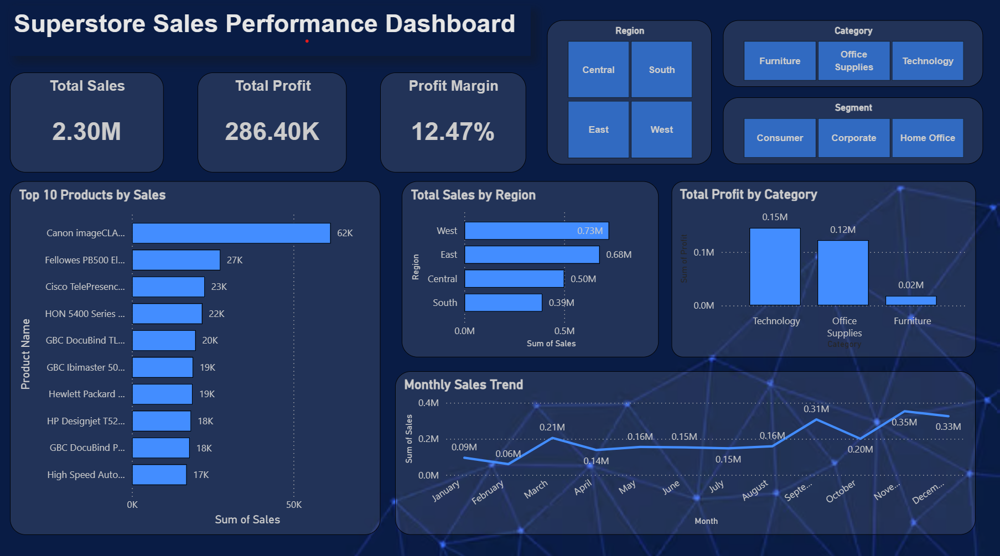

# Superstore Sales Performance Dashboard

## Project Overview

This project analyzes retail sales performance using the Superstore dataset.
The objective is to identify trends in revenue, profitability, product performance, and regional sales distribution.

The analysis includes data cleaning, exploratory data analysis (EDA), and the development of an interactive business intelligence dashboard.

---

## Tools & Technologies

* Python (Pandas, Matplotlib)
* Power BI
* Data Cleaning & Exploratory Data Analysis
* Data Visualization

---

## Dataset

The dataset contains approximately **9,994 retail transactions** including:

* Order Date
* Product Category
* Sales
* Profit
* Region
* Customer Segment

---

## Dashboard Preview

---

## Key Metrics

* **Total Sales:** $2.30M
* **Total Profit:** $286K
* **Profit Margin:** 12.47%

---

## Key Insights

### Regional Performance

The **West region generates the highest revenue**, followed by the East region, while the South region contributes the lowest sales.

### Category Profitability

Technology products produce the highest profit, while Furniture shows significantly lower profit margins.

### Sales Seasonality

Sales increase toward the end of the year, with the highest revenue observed in **November and December**, indicating strong seasonal demand.

### Product Concentration

A small number of products generate a large portion of total revenue, with **Canon printers emerging as the top-selling product**.

---

## Project Workflow

1. Data cleaning and preprocessing using Python
2. Exploratory Data Analysis (EDA)
3. Feature engineering (profit margin, shipping delay)
4. Dashboard development using Power BI
5. Business insight generation

---

## Files Included

* `data/superstore_clean.csv` → cleaned dataset
* `notebook/data_analysis.ipynb` → Python analysis
* `dashboard/superstore_dashboard.pbix` → Power BI dashboard
* `images/dashboard_preview.png` → dashboard screenshot

---

## Author

Manideep Kotha

